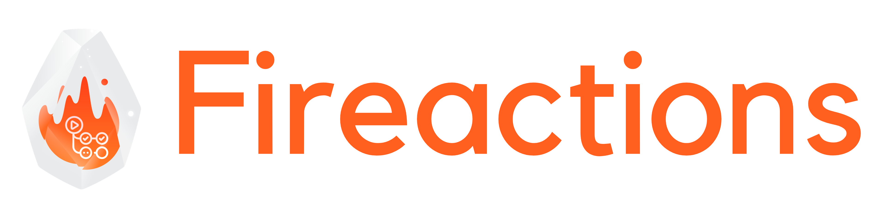

[](https://github.com/hostinger/fireactions/actions/workflows/test.yaml)



Fireactions is an orchestrator for GitHub runners. BYOM (Bring Your Own Metal) and run self-hosted GitHub runners in ephemeral, fast and secure [Firecracker](https://firecracker-microvm.github.io/) based virtual machines.


Several key features:

- **Autoscaling**

  Robust pool based scaling, cost-effective with fast GitHub runner startup time of 20s~.

- **Ephemeral**

  Each virtual machine is created from scratch and destroyed after the job is finished, no state is preserved between jobs, just like with GitHub hosted runners.

- **Customizable**

  Define job labels and customize virtual machine resources to fit Your needs. See [Configuration](./docs/configuration.md) for more information.

## Quickstart

To start using self-hosted GitHub runners, add the label to your workflow jobs:

```yaml
<...>
runs-on:
- self-hosted
# e.g. fireactions-2vcpu-4gb
- <JOB_LABEL>
```

See [Configuration](./docs/user-guide/configuration.md) for more information on how to configure job labels.

## Contributing

See [CONTRIBUTING.md](CONTRIBUTING.md) for more information on how to contribute to Fireactions.

## License

See [LICENSE](LICENSE)
