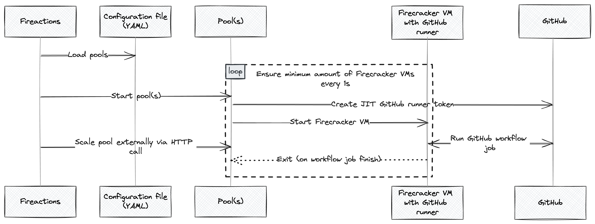

# fireactions [](https://github.com/hostinger/fireactions/actions/workflows/test.yaml)

BYOM (Bring Your Own Metal) and run self-hosted GitHub runners in ephemeral, fast and secure [Firecracker](https://firecracker-microvm.github.io/) based virtual machines.



## Features

- Autoscaling based on received GitHub webhooks for `workflow_job` events.
- Support for multiple GitHub organisations
- Fast startup time of 15-30 seconds (from webhook received event to job running).
- Security by design: ephemeral virtual machines, no persistent storage. No need to worry about secrets left on the virtual machine.
- Support for `x86_64`, `arm64` architectures and multiple Linux kernel (LTS) versions.
- Support for multiple Linux distributions (Ubuntu 20.04 and Ubuntu 22.04).
- VM resource allocation (vCPUs, RAM) based on GitHub job labels.

## Usage

To start using self-hosted GitHub runners, add the label to your workflow jobs:

```yaml
<...>
runs-on:
- self-hosted
- actions-group1-2cpu-4gb-ubuntu-22.04
```

Job labels identify the type of virtual machine to create for the Job. Label must begin with prefix `actions-` and must be followed by the provisioner name, number of vCPUs, amount of RAM and the operating system.

The label format is based on the following template:

`<PREFIX>-<GROUP>-<VCPUs>cpu-<RAM>gb-<OS>-<KERNEL-VERSION>`

Examples:

- `actions-group1-2vcpu-4gb-ubuntu22.04-5.10`
- `actions-group1-4vcpu-8gb-ubuntu20.04-4.14`
- `actions-group1-4vcpu-8gb`

In the above examples, the virtual machine will have 2 vCPUs, 4GB of RAM and will run Ubuntu 22.04 or Ubuntu 20.04 with Linux kernel 5.10 or 4.14 respectively.

In case of an invalid label, the virtual machine will not be created and the job will be skipped.

## Roadmap

- Support for right-sizing virtual machines based on actual (historical) GitHub job resource usage via [Prometheus](https://prometheus.io/)

## License

[Apache License, Version 2.0](LICENSE)
